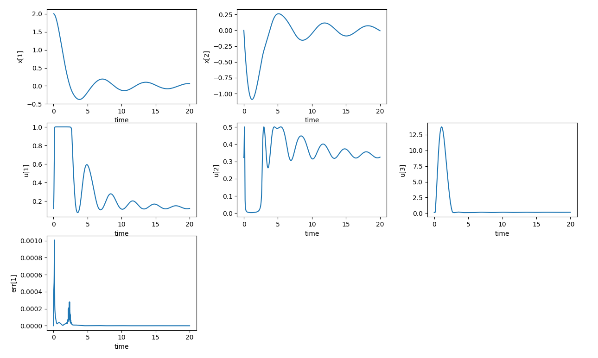
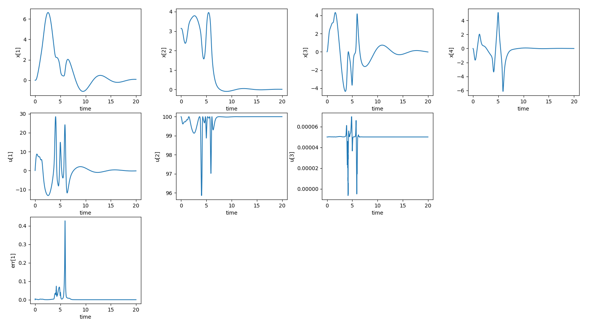

# nmpc_cgmres
Non-linear model predictive control (NMPC) with continuation/GMRES method (C/GMRES)

[](https://github.com/isri-aist/NMPC/actions/workflows/ci.yaml)
[](https://isri-aist.github.io/NMPC/nmpc_cgmres/index.html)

## Install
See [here](https://isri-aist.github.io/NMPC/doc/Install).

## Technical details
See the following for a detailed algorithm.
- T Ohtsuka. Continuation/GMRES method for fast computation of nonlinear receding horizon control. Automatica, 2004.
- https://www.coronasha.co.jp/np/isbn/9784339033182/
- https://www.coronasha.co.jp/np/isbn/9784339032109/

The source code implementation is based on the following.
- https://www.maizuru-ct.ac.jp/control/kawata/iscie2/vol56_no6_09_ohtsuka.html

## Examples
Make sure that it is built with `--catkin-make-args tests` option.

### Semiactive damper

```bash
$ rosrun nmpc_cgmres TestCgmresSolver --gtest_filter=*SemiactiveDamperProblem
$ rosrun nmpc_cgmres plotCgmresData.py
```


### Cart-pole

```bash
$ rosrun nmpc_cgmres TestCgmresSolver --gtest_filter=*CartPoleProblem
$ rosrun nmpc_cgmres plotCgmresData.py
```

