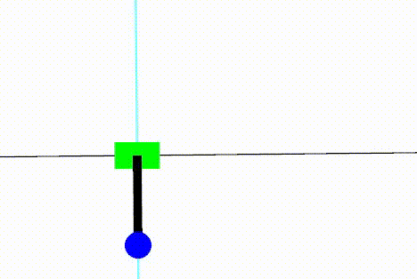

# nmpc_ddp
Non-linear model predictive control (NMPC) with differential dynamic drogramming (DDP)

[](https://github.com/isri-aist/NMPC/actions/workflows/ci.yaml)
[](https://isri-aist.github.io/NMPC/nmpc_ddp/index.html)



## Features
- C++ header-only library
- Treats state and control input dimensions as template parameters
- Supports time-varying control input dimensions
- Supports constrained control input

## Install
See [here](https://isri-aist.github.io/NMPC/doc/Install).

## Control method
See the following for a detailed algorithm.
- Y Tassa, T Erez, E Todorov. Synthesis and stabilization of complex behaviors through online trajectory optimization. IROS, 2012.
- Y Tassa, N Mansard, E Todorov. Control-limited differential dynamic programming. ICRA, 2014.

The source code implementation is based on the following.
- https://www.mathworks.com/matlabcentral/fileexchange/52069-ilqg-ddp-trajectory-optimization

## Examples
Make sure that it is built with `--catkin-make-args tests` option.

### [Bipedal dynamics](tests/src/TestDDPBipedal.cpp)
Controlling on CoM-ZMP dynamics with time-variant CoM height.
System is linear and time-variant.
```bash
$ rosrun nmpc_ddp TestDDPBipedal
$ rosrun nmpc_ddp plotTestDDPBipedal.py
```


### [Vertical motion](tests/src/TestDDPVerticalMotion.cpp)
Controlling vertical motion with time-variant number of contacts (including floating phase).
System is linear and time-variant.
The dimension of the control input changes (there are even time steps with an empty control input).
The upper and lower limits are imposed on the control input.
```bash
$ rosrun nmpc_ddp TestDDPVerticalMotion --gtest_filter=*.WithConstraint
$ rosrun nmpc_ddp plotTestDDPVerticalMotion.py
```


### [Cart-pole](tests/src/TestDDPCartPole.cpp)
Controlling cart-pole (also known as inverted pendulum).
System is non-linear.
This is an example of a realistic setup where the control and simulation have different time periods.
```bash
# 10-second simulation
$ rostest nmpc_ddp TestDDPCartPole.test --text
# Endless simulation
$ rostest nmpc_ddp TestDDPCartPole.test no_exit:=true --text
```
  
You can interactively add disturbances and change the target position via the GUI. See the [video](https://www.dropbox.com/s/c3xf67wiffvoj6q/TestDDPCartPole-20220328.mp4?dl=0).
